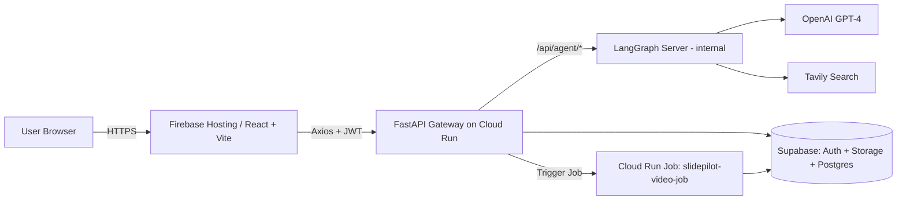
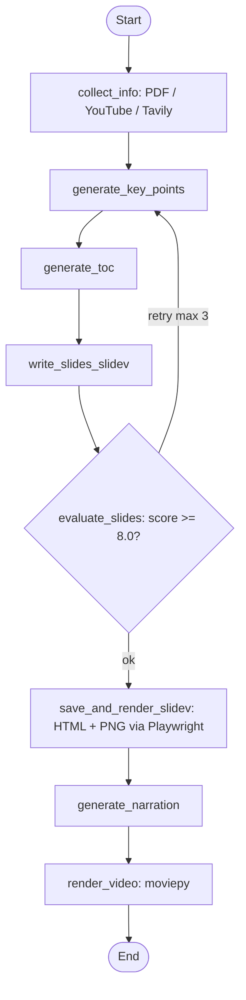

# Learnify - AI-Powered Multimodal Learning
*An AI learning assistant that transforms PDFs, YouTube videos, and text into easy-to-understand slides and narrated videos — reducing cognitive load for every learner.*

---

##  Overview / 概要

EN:
In recent years, the cost of multimodal generation has steadily decreased, and as it continues to decline, generating text, audio, and video is becoming increasingly practical and accessible. This trend suggests new opportunities for automating content production workflows.
Learnify explores this direction by turning PDFs, research papers, and YouTube lectures into narrated slides and rendered videos tailored to each learner's level and goals — making personalized learning the default, not the exception.

JP（補足）：
マルチモーダル生成のコストが下がり、資料をナレーション付き動画へ変換することが現実的な選択肢になりました。Learnifyは、PDF・YouTube・テキストといった多様な入力から、一人一人の理解度や目的に合わせた動画教材を生成することで、学びの個別最適化を目指すプロトタイプです。

---

##  Demo

- [Learnify](https://slide-pilot-474305.web.app/)

---

##  Key Features

- **Multi-source input** — PDF, YouTube URL, or free-form text (auto-detected)
- **3 learning modes** — Quick (gist) / Deep (thorough explanation) / Share (presentation-ready)
- **Quality evaluation loop** — Slide output is scored on 5 criteria; auto-retries up to 3x if score < 8.0
- **Async video rendering** — Offloaded to Cloud Run Jobs so the UX stays responsive
- **Slidev-based slide generation** — `apple-basic` theme with `v-clicks` progressive disclosure
- **Narration + video composition** — TTS narration is mixed with slide images via moviepy
- **Real-time progress** — Server-Sent Events stream each workflow node to the UI
- **Google OAuth + Supabase JWT** — End-to-end authenticated flow with row-level security

---

##  Architecture

### System Architecture



- **Gateway pattern** — The frontend talks to a single FastAPI endpoint. LangGraph runs as an internal service behind it, which keeps CORS and auth concerns in one place.
- **Async offload** — Heavy video rendering is pushed to Cloud Run Jobs, so the API stays responsive even when a render takes minutes.

### AI Workflow (LangGraph)



The evaluation loop is implemented in [backend/app/agents/slide_workflow.py](backend/app/agents/slide_workflow.py). Scoring criteria switch dynamically based on the input type (educational PDF vs. technical AI news), so the quality bar fits the content.

---

##  Tech Stack

| Category  | Technologies |
|-----------|--------------|
| Frontend  | React 18 / TypeScript / Vite / React Router v7 / TanStack Query / Recoil |
| Backend   | Python 3.11 / FastAPI / LangGraph 0.5 / LangSmith |
| AI / LLM  | OpenAI GPT-4 / Tavily (web search) |
| Slides    | Slidev (apple-basic theme) / Playwright (HTML → PNG) |
| Video     | moviepy (composition) / TTS |
| Data      | Supabase (Postgres + Storage + Auth) |
| Infra     | Firebase Hosting / Cloud Run / Cloud Run Jobs / GCP Secret Manager |
| CI/CD     | GitHub Actions (frontend / backend / video-job) / Workload Identity Federation |

---

##  Quick Start

> Prerequisites: Python 3.11+, Node 20+, `@slidev/cli`, `playwright-chromium`.
> Minimum env vars — Backend: `OPENAI_API_KEY`, `TAVILY_API_KEY`, `SUPABASE_URL`, `SUPABASE_ANON_KEY`. Frontend: `VITE_GOOGLE_CLIENT_ID`, `VITE_SUPABASE_URL`, `VITE_SUPABASE_ANON_KEY`.

Start the three services **in this order**: LangGraph (2024) → FastAPI (8001) → Frontend (5173).

```sh
git clone https://github.com/miyata09x0084/slide-pilot
cd slide-pilot

# 1. LangGraph (AI Engine) — from the repository root
python3.11 -m langgraph_cli dev --host 0.0.0.0 --port 2024

# 2. FastAPI (Gateway)
cd backend/app && python3 main.py

# 3. Frontend
cd frontend && npm install && npm run dev
```

---

##  Project Structure

```
slide-pilot/
├── backend/
│   ├── app/
│   │   ├── agents/      # LangGraph workflows (slide_workflow, react_agent)
│   │   ├── routers/     # FastAPI endpoints (uploads, slides, agent proxy, render)
│   │   ├── prompts/     # Externalized prompts (slide / evaluation / narration)
│   │   └── core/        # Supabase / Cloud Run / Storage
│   └── jobs/            # Cloud Run Job (video rendering)
└── frontend/
    └── src/features/    # dashboard / generation / slide / auth
```

---

##  My Role & Contributions

- Architected the full monorepo: Frontend + FastAPI gateway + LangGraph + Cloud Run Jobs
- Designed a 7-node LangGraph pipeline with an evaluation loop that auto-retries when slide quality drops below 8.0/10
- Offloaded heavy video rendering to Cloud Run Jobs to keep the gateway non-blocking under load
- Built the auth layer: Google OAuth on the frontend, Supabase JWT verification middleware on the backend
- Implemented real-time progress streaming via SSE across the 7-step generation flow
- Externalized every prompt to `backend/app/prompts/` for version-controllable iteration
- Set up 3 GitHub Actions pipelines with keyless GCP deploys via Workload Identity Federation

---

##  What I Learned

- Practical approaches to LLM API integration (not model training)
- Designing stateful AI workflows with retry/evaluation loops in LangGraph
- Multimodal UI/UX challenges (text → slides → narrated video)
- Trade-offs between synchronous API responses and async job queues for heavy compute
- Schema-driven secret management (`.env.schema.yml`) for CI/CD safety
- Improved backend structure, naming, and async patterns
- Balancing prototype velocity vs. maintainable architecture
