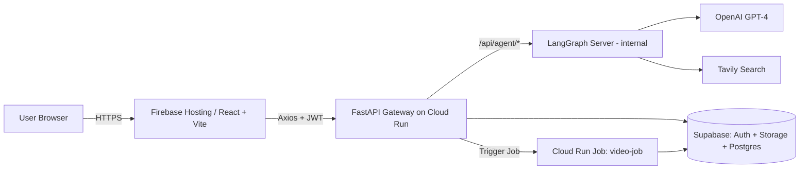
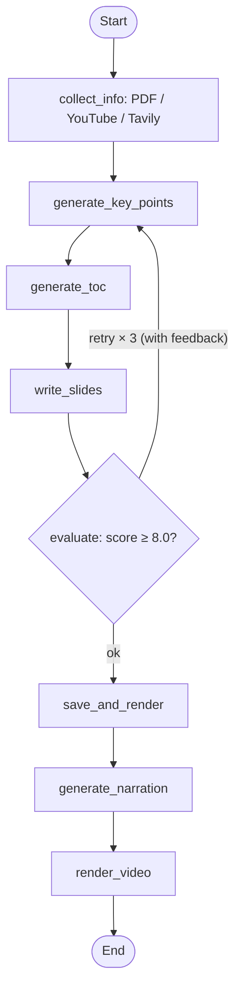

# Learnify
> A proof-of-concept on putting LangGraph in end users' hands.
> A multimodal learning workflow (PDF → evaluated slides →
> narrated video) wrapped in a real web app — auth, progress
> streaming, and async jobs included.

**[Live demo →](https://slide-pilot-474305.web.app/)**

---

## Why

I wanted personalized learning material for myself. But the
question that took over wasn't pedagogical — it was a delivery
question: LangGraph is powerful, but can you actually put it in
a non-developer's hands? Not as a CLI, but as a web app a general
user can drive — with auth, real-time progress, and async
rendering all holding together?

---

## How It Works

### System Architecture



The delivery layer that wraps LangGraph for end users: one entry
point for the browser, JWT enforcement, and async offload to
Cloud Run Jobs so heavy renders don't block real-time progress.

### AI Pipeline (LangGraph)



A single stateful workflow with a self-evaluation gate. Scoring
criteria switch by input type (PDF vs. AI news); the workflow
retries up to 3× before giving up. Each node update streams back
to the UI via SSE — the user sees progress in real time.
[`slide_workflow.py`](backend/app/agents/slide_workflow.py)

---

## Tech Stack

| Layer | Stack |
|---|---|
| **AI Workflow** | LangGraph / LangSmith / OpenAI / Tavily |
| **Backend** | FastAPI |
| **DB** | Supabase (Auth + Storage + Postgres) |
| **Frontend** | React + TypeScript / Vite / TanStack Query |
| **Rendering** | Slidev (apple-basic) → Playwright → moviepy + TTS |
| **Ops** | Firebase Hosting / Cloud Run + Cloud Run Jobs / GitHub Actions + Workload Identity Federation |

---

## Quick Start

> **Prereqs**: Python 3.11+, Node 20+, `@slidev/cli`, `playwright-chromium`
> **Env vars**: WIP — see `backend/.env.schema.yml` for the source of truth.

Start the three services **in this order** — LangGraph (2024) → FastAPI (8001) → Frontend (5173):

```sh
git clone https://github.com/miyata09x0084/slide-pilot
cd slide-pilot

# 1. LangGraph (AI engine) — from repo root
python3.11 -m langgraph_cli dev --host 0.0.0.0 --port 2024

# 2. FastAPI (gateway)
cd backend/app && python3 main.py

# 3. Frontend
cd frontend && npm install && npm run dev
```
